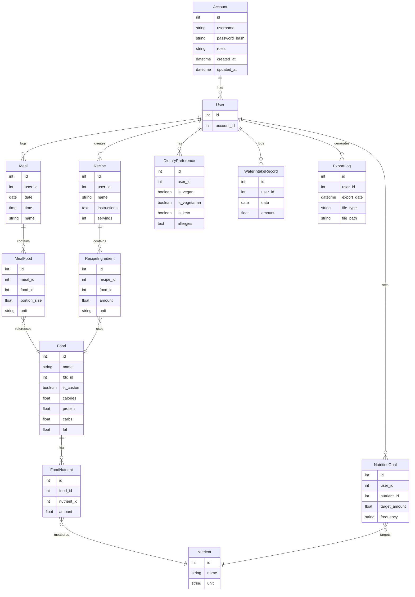

```mermaid
erDiagram
    Account ||--o{ User : has
    User ||--o{ Meal : logs
    User ||--o{ Recipe : creates
    User ||--o{ NutritionGoal : sets
    User ||--o{ DietaryPreference : has
    User ||--o{ WaterIntakeRecord : logs
    User ||--o{ ExportLog : generates
    Meal ||--o{ MealFood : contains
    MealFood }o--|| Food : references
    Food ||--o{ FoodNutrient : has
    FoodNutrient }o--|| Nutrient : measures
    Recipe ||--o{ RecipeIngredient : contains
    RecipeIngredient }o--|| Food : uses
    NutritionGoal }o--|| Nutrient : targets

    Account {
        int id
        string username
        string password_hash
        string roles
        datetime created_at
        datetime updated_at
    }
    User {
        int id
        int account_id
    }
    Meal {
        int id
        int user_id
        date date
        time time
        string name
    }
    MealFood {
        int id
        int meal_id
        int food_id
        float portion_size
        string unit
    }
    Food {
        int id
        string name
        int fdc_id
        boolean is_custom
        float calories
        float protein
        float carbs
        float fat
    }
    FoodNutrient {
        int id
        int food_id
        int nutrient_id
        float amount
    }
    Nutrient {
        int id
        string name
        string unit
    }
    Recipe {
        int id
        int user_id
        string name
        text instructions
        int servings
    }
    RecipeIngredient {
        int id
        int recipe_id
        int food_id
        float amount
        string unit
    }
    NutritionGoal {
        int id
        int user_id
        int nutrient_id
        float target_amount
        string frequency
    }
    DietaryPreference {
        int id
        int user_id
        boolean is_vegan
        boolean is_vegetarian
        boolean is_keto
        text allergies
    }
    WaterIntakeRecord {
        int id
        int user_id
        date date
        float amount
    }
    ExportLog {
        int id
        int user_id
        datetime export_date
        string file_type
        string file_path
    }
```